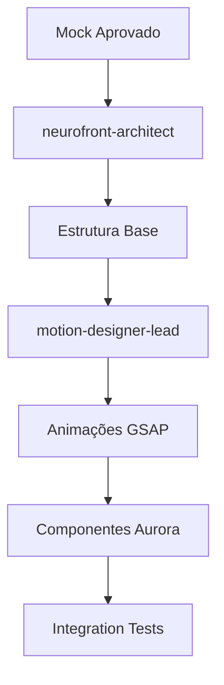

# 🚀 AUTONOMOUS PIPELINE - SOVEREIGN WORKFLOW
## Pipeline 100% Autônomo para Entrega de Sites S-Tier

**Versão:** 1.0  
**Data:** Janeiro 2026  
**Propósito:** Definir o fluxo completo de automação desde o briefing até o deploy, sem intervenção humana além da solicitação inicial.

---

## 📊 VISÃO GERAL DO FLUXO

```
┌─────────────────────────────────────────────────────────────────────────────┐
│                        AUTONOMOUS PIPELINE                                  │
│                                                                             │
│  ┌─────────┐   ┌─────────┐   ┌─────────┐   ┌─────────┐   ┌─────────┐       │
│  │ BRIEFING│──▶│  MOCK   │──▶│  BUILD  │──▶│   QA    │──▶│ DEPLOY  │       │
│  │ (Human) │   │(Stitch) │   │(Agents) │   │(Director)│   │(Vercel) │       │
│  └─────────┘   └─────────┘   └─────────┘   └─────────┘   └─────────┘       │
│      │              │              │              │              │          │
│      ▼              ▼              ▼              ▼              ▼          │
│  ┌─────────┐   ┌─────────┐   ┌─────────┐   ┌─────────┐   ┌─────────┐       │
│  │ Input   │   │ UI Gen  │   │ Code    │   │ Gates   │   │ Preview │       │
│  │ único   │   │ via AI  │   │ S-Tier  │   │ 0-4     │   │ + Live  │       │
│  └─────────┘   └─────────┘   └─────────┘   └─────────┘   └─────────┘       │
└─────────────────────────────────────────────────────────────────────────────┘
```

---

## 🎯 FASE 0: BRIEFING (ÚNICA INTERAÇÃO HUMANA)

### Input Necessário do Usuário:

```yaml
briefing:
  projeto: "Nome do Projeto"
  arquétipo: "Sovereign | Cyber | Editorial"
  objetivo: "Descrição do objetivo principal"
  publico_alvo: "Descrição do público"
  
referencias:
  - url: "https://exemplo.com"
    motivo: "O que admirar neste site"
  - url: "https://outro.com"
    motivo: "Elemento específico a capturar"
  
visual_hook: "O momento WOW principal (ex: Black Hole que suga o hero)"
  
requisitos:
  paginas: ["Home", "Sobre", "Serviços", "Contato"]
  features: ["Dashboard", "Forms", "Animations"]
  integrações: ["API X", "Serviço Y"]
```

### Agente Responsável: `sovereign-workflow-director`
- Valida completude do briefing
- Define arquétipo e paleta
- Aprova ou solicita clarificações

---

## 🎨 FASE 1: MOCK GENERATION (Google Stitch MCP)

### Trigger Automático:
```
@stitch-mcp generate-landing-page --prompt="${briefing}" --style="${arquétipo}"
```

### Processo:
1. **Stitch MCP** recebe o briefing processado
2. Gera wireframes/mockups via Gemini AI
3. Exporta para Figma ou diretamente como código
4. Agente valida se mock atende ao arquétipo

### Outputs:
- `design/mockup.fig` ou `design/mockup.html`
- `design/components.json` (lista de componentes)
- `design/color-palette.json` (paleta extraída)

### Skill Utilizada:
```yaml
skill: stitch_mcp
location: .agent/skills/stitch_mcp/SKILL.md
```

---

## 🏗️ FASE 2: CONSTRUÇÃO AUTÔNOMA

### Agentes Orquestrados:

| Agente | Responsabilidade | Output |
|--------|-----------------|--------|
| `neurofront-architect` | Estrutura e arquitetura | Layout, routing, types |
| `motion-designer-lead` | Estratégia de movimento | `motion-strategy.md` |
| `elysian-architect` | Separação front/back | Contracts, mocks SDK |
| `senior-art-director` | Direção visual | `art-direction-brief.md` |
| `copywriter-certum-elite` | Copy premium | Textos otimizados |

### Fluxo de Construção:



### Componentes Automáticos (Aurora Library):

```typescript
// Primitivos Obrigatórios (auto-inject)
- SmoothScroller.tsx     // Lenis wrapper
- SovereignCursor.tsx    // Cursor premium
- GenesisPreloader.tsx   // Loading cinematográfico
- MagneticButton.tsx     // Hover magnético

// Efeitos Selecionados por Arquétipo
- HeroEventHorizon.tsx   // Sovereign: Black Hole
- SpiralVortexMenu.tsx   // Menu premium
- ParallaxLayer.tsx      // Profundidade
- TextSplitReveal.tsx    // Typography reveal
- Tilt3DCard.tsx         // Cards interativos
```

### Biblioteca de Efeitos Disponível:
```
.agent/biblioteca/Claude/Biblioteca de efeitos/
├── black-hole-effect-v1.html
├── black-hole-effect-v2-variations.html
├── black-hole-reveal.html
├── magnetic-interactions.html
├── parallax-depth-stack.html
├── spiral-vortex-menu.html
├── AURORA EFFECTS LIBRARY v1.0.md
├── BLACK_HOLE_TECHNIQUE.md
└── CATALOG.md
```

---

## ✅ FASE 3: QA AUTOMÁTICO (Gates 0-4)

### Agente Responsável: `sovereign-workflow-director`

### Gate 0: Referência & DNA
```yaml
validação:
  - arquétipo_definido: true
  - referencias_analisadas: 3+
  - visual_hook_descrito: true
```

### Gate 1: Setup
```yaml
validação:
  - arquitetura_hibrida: true  # Fixed Hero + Scroll Content
  - cores_semanticas: true     # CSS variables
  - typography_fluida: true    # clamp(), zero breakpoints
  - lenis_funcionando: true
```

### Gate 2: Primitivos
```yaml
validação:
  - cursor_customizado: true
  - preloader_cinematico: true
  - data_attributes: true
  - magnetic_elements: true
```

### Gate 3: Cinematografia
```yaml
validação:
  - hero_punch: true           # Wow factor
  - efeitos_aurora: 3+         # Mínimo 3 efeitos
  - parallax_camadas: 3+       # Mínimo 3 velocidades
  - easings_corretos: true     # power4, expo, elastic
```

### Gate 4: QA Final
```yaml
validação:
  - transformation_test: "transformando"  # Não "rolando"
  - fifty_k_test: true         # Parece $50k+
  - lighthouse: 85+            # Performance
  - mobile: true               # Touch, responsive
```

### Comando de Validação:
```
@sovereign-workflow-director FULL-AUDIT --gates=all --auto-fix=true
```

---

## 🚀 FASE 4: DEPLOY AUTOMÁTICO

### MCPs Integrados:

| MCP | Função | Trigger |
|-----|--------|---------|
| GitHub | Versionamento | Commit automático |
| Vercel | Deploy | Push → Preview → Production |

### Fluxo de Deploy:

```bash
# 1. Commit automático após Gate 4 aprovado
git add .
git commit -m "feat: ${projeto} - S-Tier certified ✅"
git push origin main

# 2. Vercel detecta push e inicia deploy
# 3. Preview URL gerada automaticamente
# 4. Testes de performance em staging
# 5. Promoção para production
```

### Validação Pós-Deploy:
```yaml
checks:
  - lighthouse_production: 85+
  - ssl_certificate: valid
  - cdn_propagation: complete
  - dns_resolution: ok
```

### Skills Utilizadas:
```yaml
github:
  location: .agent/skills/github/SKILL.md
  
vercel:
  location: .agent/skills/vercel/SKILL.md
```

---

## 📋 TRIGGER DO PIPELINE COMPLETO

### Comando Único para Iniciar:

```
@sovereign-workflow-director START-AUTONOMOUS-PIPELINE
  --briefing="briefing.yaml"
  --arquétipo="Sovereign"
  --referencias=["url1", "url2", "url3"]
  --auto-deploy=true
```

### Ou via Workflow File:

```yaml
# .agent/workflows/start-project.yaml
name: "Novo Projeto S-Tier"
trigger: manual
input:
  - briefing_file
  - arquétipo
  - referencias

steps:
  - agent: sovereign-workflow-director
    action: validate-briefing
    
  - mcp: stitch
    action: generate-mock
    
  - agent: neurofront-architect
    action: build-structure
    
  - agent: motion-designer-lead
    action: apply-animations
    
  - agent: sovereign-workflow-director
    action: full-audit
    gates: [0, 1, 2, 3, 4]
    
  - mcp: github
    action: commit-and-push
    
  - mcp: vercel
    action: deploy-production
```

---

## 📊 MÉTRICAS DE SUCESSO

| Métrica | Target | Medição |
|---------|--------|---------|
| Tempo Mock → Deploy | < 4 horas | Timestamp |
| Gates Aprovados | 100% | Audit log |
| Lighthouse Score | > 85 | Automated |
| Zero Intervenção Manual | ✅ | Process log |
| S-Tier Certification | ✅ | Final audit |

---

## 🔗 INTEGRAÇÕES ATIVAS

### MCPs Configurados:

| MCP | Status | Configuração |
|-----|--------|--------------|
| Google Stitch | ✅ Ativo | `stitch_mcp/SKILL.md` |
| GitHub | ✅ Ativo | `github/SKILL.md` |
| Vercel | ✅ Ativo | `vercel/SKILL.md` |

### Agentes Disponíveis:

| Agente | Role | Status |
|--------|------|--------|
| sovereign-workflow-director | QA Director | ✅ Ativo |
| neurofront-architect | Frontend Lead | ✅ Ativo |
| motion-designer-lead | Motion Strategy | ✅ Ativo |
| elysian-architect | Architecture | ✅ Ativo |
| senior-art-director | Visual Direction | ✅ Ativo |
| copywriter-certum-elite | Copy Premium | ✅ Ativo |
| saas-conductor | SaaS Features | ✅ Ativo |
| site-construction-documenter | Documentation | ✅ Ativo |

### Biblioteca de Assets:

```
.agent/biblioteca/
├── Claude/
│   └── Biblioteca de efeitos/   # Efeitos prontos para uso
├── Documentação de bibliotecas/  # Docs técnicos
├── Documento tecnicos/           # Manuais
├── Estudos/                      # Research
└── OS/                           # Operating Systems
```

---

## 🎯 RESULTADO ESPERADO

Após uma única interação humana (briefing), o pipeline entrega:

1. **Mock Visual** - Gerado via Google Stitch AI
2. **Código S-Tier** - Next.js + GSAP + Lenis + Aurora Library
3. **QA Certificado** - Todos os 5 Gates aprovados
4. **Deploy Live** - Produção no Vercel com SSL

**Tempo Total:** ~4 horas (variável por complexidade)
**Intervenção Humana:** Apenas briefing inicial

---

**Pipeline criado para o Sovereign Workflow v3.0**  
**Aurora AI | Janeiro 2026**
